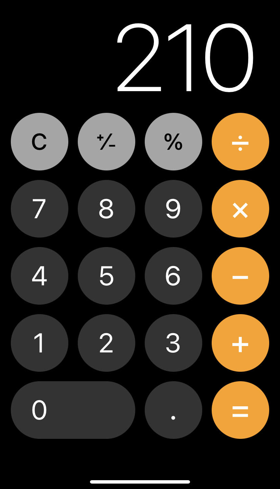

# Iphone Calculator Replication or something close enough

## Target Audience
The calculator will provide a user-friendly interface, inspired by the famous iPhone. The project will also 
target a wide range of users, anyone who in need of a reliable and easy-and-quick-to-use calculator on their electronic 
device. Whether you're solving a math problem from homework, calculating a financial problem, or even working on a
scientific problem that will decide the fate of the world, a handy calculator will come in place in a most seamless 
and efficient way.
## Feature

- **Standard operation:** addition, subtraction, multiplication, and division
- **Continuity calculation:** allow user to follow up the calculation with the previous result
- **Scientific functions:** square root, exponentiation, and trigonometric calculations.
- **Interface:** UI similar to the image below ↓

## Motivation
The project is a great inspiration for me, firstly as an Iphone user and secondly as a mathematics enjoyer. The project 
also require me to be able to not only using mathematical function but also designing a user interface, which is a new
aspect of coding that I have never done before. Lastly, I choose to design a calculator that not only leverage my skills
in Java but also delivery a useful tool that can help a wide range of user.
An example of text with **bold** and *italic* fonts.  

## User want:

- As a user, I want to be able to perform standard operation
- As a user, I want to continue my calculation with the previous result
- As a user, I want to perform scientific functions
- As a user, I want to view my results in a history log
- As a user, I want to reset my history log
- As a user, I want to save the last result that I got, output from the program, and the history log
- As a user, I want to continue with the result history and the last input that I got from earlier time.
- As a user, I want to be able to add multiple Operations to the Calculator

## Instructions for User:
- You can add multiple Operations to Calculator simply by clicking any operation button
- You can remove all of Operations to Calculator by clicking "reset" button
- You can locate my visial component when ever you run the file CalculatorLauncher file
- You can save the state of my application by clicking "save" button
- You can reload the state of the application by clicking "reload" button

# Phase 4: Task 2:
Sun Nov 26 17:28:48 PST 2023
New operation added to calculator: +

Sun Nov 26 17:28:50 PST 2023
Add new result to history: 16.0

Sun Nov 26 17:28:50 PST 2023
New operation added to calculator: -

Sun Nov 26 17:28:52 PST 2023
Add new result to history: 10.0

Sun Nov 26 17:29:02 PST 2023
Saved calculator to calculator.json

Sun Nov 26 17:29:03 PST 2023
Remove all result in history

Sun Nov 26 17:29:03 PST 2023
Remove all operation in operations

